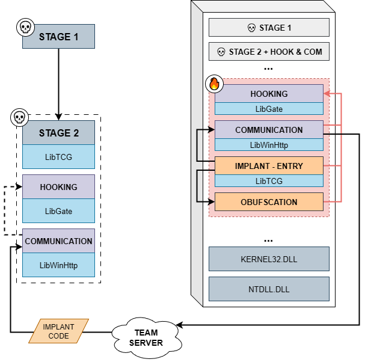

# PICO-Implant

PICO-Implant is a Proof of Concept C2 implant built using Position-independent Code Objects (PICO) for modular functionality. This project demonstrates that It's possible to build a multi-stage and modular C2 implant made of PICOs.



## Key Features

- **Multi-stage Architecture**: Three-stage execution flow (Stage 1 → Stage 2 → Implant Core).
- **Position Independent Code**: All modules built as PICOs for maximum flexibility.
- **Modular Design**: Separate modules for communication, entry point and obfuscation.
- **Remote Loading**: Stage 2 remotely loads core implant code.
- **LibTP Integration**: Hook calls from the implant itself to make API calls more stealthy.

## Architecture Overview

**Important Note**: This is not a fully functional implant but rather a Proof of Concept demonstrating the feasibility of building modular C2 implants using PICOs. The implementation focuses on core architectural concepts rather than complete operational functionality.

The PoC consists of three main modules:

### 1. Communication Module (`transport.c`)
Provides basic communication between the Team Server and implant. In this PoC implementation:
- Simple health check functionality to demonstrate server communication.

**Note**: In a real implant, this would be significantly more complex with full command parsing, response formatting, and encryption capabilities.

### 2. Entry Point Module (`entry.c`)
Where a real implant would handle task management:
- Basic loop for health check and sleep.

### 3. Obfuscation Module (`obfuscation.c`)
Implements sleep obfuscation capabilities using the **Ekko** technique.

## Dependencies

### Shared Libraries

- **LibTCG**: Core Crystal Palace functionality for PIC operations
- **LibWinHTTP**: HTTP/HTTPS communication capabilities

## Usage

### Building the Modules

```bash
# Build the entry point module
./piclink ../dev/RemotePICOLoader/implant_entry.spec x64 entry.bin

# Build the obfuscation module
./piclink ../dev/RemotePICOLoader/implant_obfuscation.spec x64 obfuscation.bin

# Build Stage 1 and 2 with environment key
./piclink ../dev/RemotePICOLoader/stage1.spec x64 out.bin ENVKEY=<your_environment_key>
```

### Deployment

1. **Host Remote Modules**: Deploy `obfuscation.bin` and `entry.bin` on your web server.
2. **Deploy Stage 1**: Execute `out.bin`.
3. **Automatic Progression**: The code will automatically progress through all stages.

## Execution Flow

### Stage 1: Initial Loader
- **Identical to guardrail example**: Decrypts and prepares Stage 2.
- Performs environment validation.
- Sets up execution context.

### Stage 2: Remote Module Loader
- Prepares process memory for PICO loading.
- Loads implant PICOs into memory.
- **Cleanup**: Removes Stage 1 from memory.

### Stage 3: Main Implant Execution
- Executes the main loop.
- **Cleanup**: Removes Stage 2 from memory.

## Future Enhancements

- **PICO Management Library**: Development of a shared library for managing PICOs loaded in memory, providing better control and coordination of loaded modules.

# References

- https://github.com/rasta-mouse/LibTP
- https://github.com/pard0p/LibWinHttp

- https://tradecraftgarden.org/simplehook.html
- https://tradecraftgarden.org/simpleguard.html

- https://github.com/Cracked5pider/Ekko
